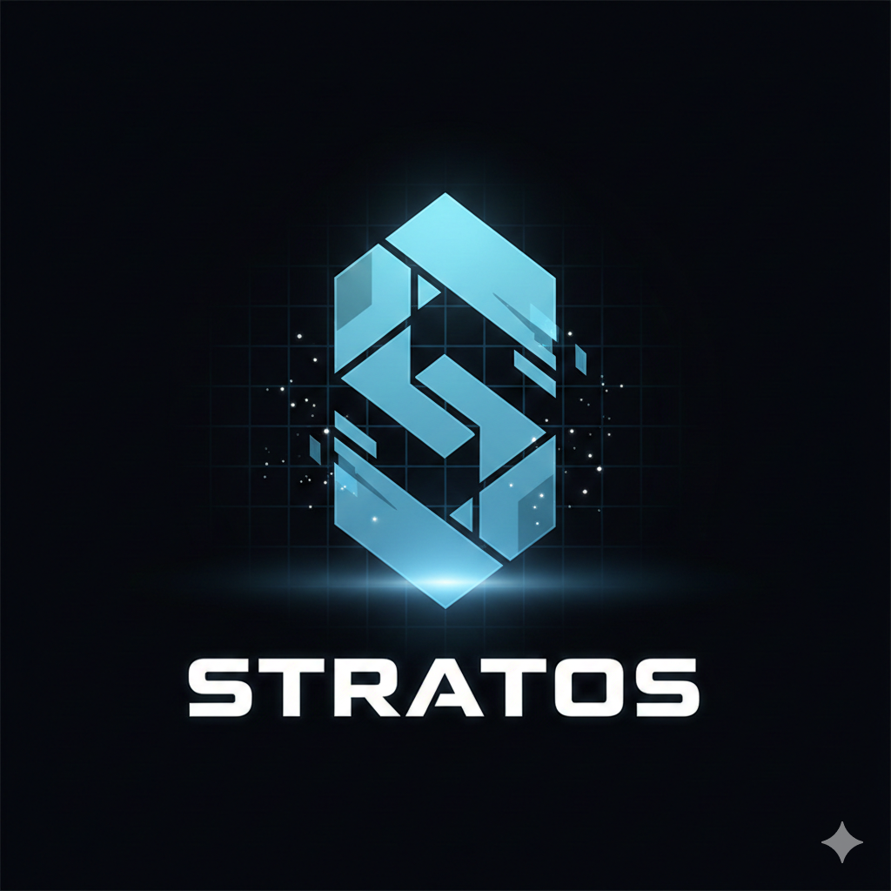

<p align="center"></p>

# Atome — Pure Flow Engine

**Crash-safe, single-writer sequencing for event-driven applications.**

[](https://go.dev)
[](#license)
[](#sdks)
[](#community-tier)

---

## What Atome is

Atome is a **flow engine**: it sequences writes to your aggregates with group-commit fsync, wires an outbox to NATS and MongoDB out of the box, and enforces idempotency in the same fsync as the commit.

Your business logic lives in a **Sidecar** you write, in the language you choose, deployed alongside the engine. Atome guarantees ordering, durability, and idempotency. You own the rules.

```
Your Sidecar (Go / Python / Java)
      │  UDS (Unix Domain Socket)
      ▼
 atome-engine  ──outbox──▶  NATS  ──▶  MongoDB (read model)
  (Pebble KV)
```

---

## Why Atome

| Without Atome | With Atome |
|---|---|
| Race conditions on concurrent writes | Single-writer sequencer — one committer, zero races |
| Re-implement idempotency in every service | Bloom + durable idem key in the same fsync as the commit |
| Saga rollback scattered across services | Two explicit consistency paths — pick your trade-off |
| Custom CQRS plumbing per project | Embedded outbox → NATS → MongoDB, wired out of the box |

**~22 000 items/s** on a local M-series Mac. **~33 000 items/s** on cloud Linux NVMe.

---

## Quickstart

The engine is distributed as a Docker image. Clone a sidecar template — it includes the `docker compose` stack that pulls the engine.

```bash
git clone https://github.com/get-stratos-labs/atome-template-workspace-go
cd atome-template-workspace-go
docker compose up -d

# Browse the live read model
open http://localhost:8081   # Mongo Express
```

Full walkthrough → [atome-template-workspace-go](https://github.com/get-stratos-labs/atome-template-workspace-go)

---

## SDKs

| Language | Package | Repo |
|---|---|---|
| Go | `github.com/get-stratos-labs/atome-sdk-go` | [atome-sdk-go](https://github.com/get-stratos-labs/atome-sdk-go) |
| Python | `atomebl` (pip) | [atome-sdk-python](https://github.com/get-stratos-labs/atome-sdk-python) |
| Java | `com.atome` (Maven) | [atome-sdk-java](https://github.com/get-stratos-labs/atome-sdk-java) |

Sidecar templates:
- [atome-template-workspace-go](https://github.com/get-stratos-labs/atome-template-workspace-go) — single-developer workspace
- [atome-template-team-go](https://github.com/get-stratos-labs/atome-template-team-go) — multi-team setup

---

## Community tier

The Community binary is **free to deploy**, rate-limited at 1 000 ops/s (≤ 5 GB logical data). Degrades gracefully to 500 ops/s instead of dropping writes (No-Cliff mode). No registration required.

| Tier | Data limit | Throughput |
|---|---|---|
| Community | ≤ 5 GB | 1 000 ops/s (floor: 500) |
| Pro | 100 GB | — |
| Scale | Unlimited | — |

---

## License

Engine: closed source, distributed as Docker image / compiled binary only. SDKs and sidecar templates: MIT.

---

<p align="center">
  Built with care by Stratos Labs // 2026
</p>
